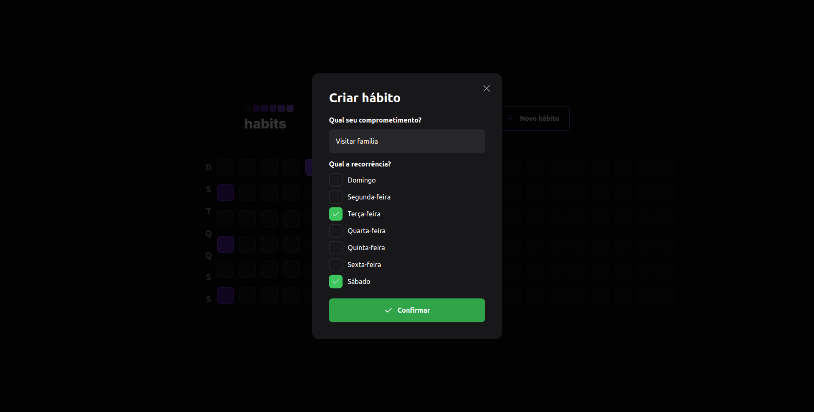
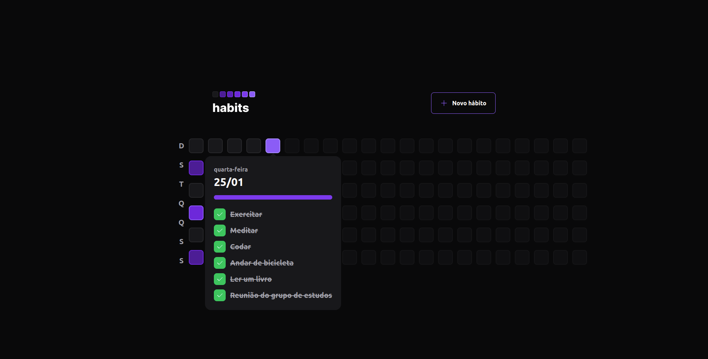

<p align="center">
  
</p>
<h3 align="center">
You are in control of your routine!
</h3>

<br><br>

<p align="center">
  
  
  
</p>
<br>

<p align="center">
  <a href="#about">About</a> •
  <a href="#habits">Habits</a> •
  <a href="#installation">installation</a> •
  <a href="#technology">technology</a> •
  <a href="#autor">Author</a>  
</p>

## About

Project developed during NLW Setup, an event created by Rocketseat. A 100% online and FREE event, with exclusive and UNPRECEDENTED content.

It took place from the 16th to the 20th of January 2023 and was intended to show in practice the power of the NodeJS + ReactJS + React Native stack and how these technologies can lead you to your biggest goals as a programmer.


## Habits

Habits is a daily task tracking app to help its users track their completed and unfulfilled activities.

The application flow is simple: the user registers the desired habits indicating which days of the week they should be performed and every day he will have a list of habits according to the current day, where he will indicate the status of each habit and the application will generate a daily progress that will be illustrated in the progress bar and also in the colors of the squares that represent the days where lighter colors represent greater numbers of complete habits.

The application has, in addition to the backend, a web and mobile application, which will be illustrated below.

### Habits - Web Application

When accessing the homepage of the web application, the user will see the page below where a button for registering a new habit and several squares representing past days, current day and future day will be displayed. As we can see below, each day has a different color, where:

- Gray indicates that no habits were performed.
- Darker colors indicate little progress in daily habits.
- Lighter colors indicate much progress in daily habits.
- Gray with reduced opacity indicates future days and is not clickable.


When clicking on the `New habit` button, the modal below will be displayed for the user to enter a title and the days of the week in which the new habit should be performed:



By clicking on one of the days, its information will be displayed, for example: its numerical date, the day of the week, the progress bar and the list of habits that must be carried out on the respective day of the week, as shown in the image below:


Note that the day square above is darker than the one in the following image. This is due to the fact that on the day below the percentage of completed habits was higher:



With that, we know all the flows of the web interface when using the application. I leave below a GIF demonstrating the application being used where I go through all the features mentioned above:


### 🖥️ Running the Front End (Web)

```bash
# Clone this repository
$ git clone git@github.com:Glendson/web-habits.git
# Access project folder in terminal/cmd
$ cd web-habits
# install the dependencies
$ npm install
# If you prefer to use Yarn, run the command below
$ yarn
# Run the application in development mode
$ npm run dev
# If you prefer to use Yarn, run the command below
$ yarn dev
# The server will start on port 5173 - acess <http://localhost:5173>
```

## Technology


<br><br><br><br>

## Author

<div align="center">

<h1>Glendson Garcete</h1>
<strong>FullStack Developer</strong>
<br/>
<br/>

<a href="https://www.linkedin.com/in/glendson-zeus-tomazetto-garcete-a2a0b190/" target="_blank">

</a>

<a href="https://github.com/glendson" target="_blank">

</a>

<a href="mailto:gztomazetto@gmail.com?subject=Fala%20Dev" target="_blank">

</a>


<br/>
<br/>
</div>